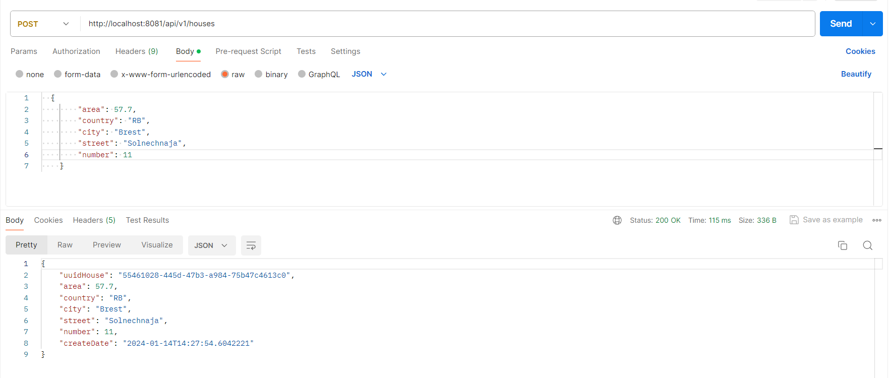
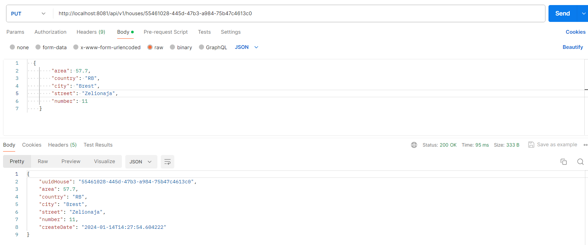
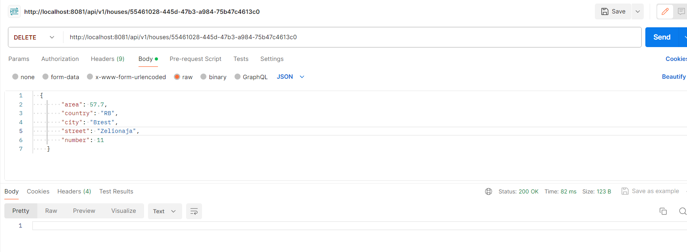
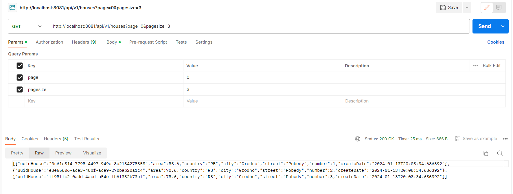
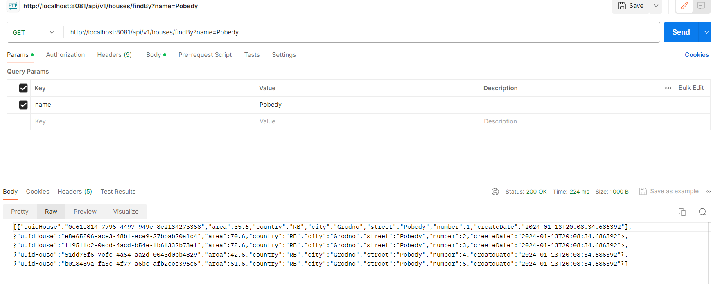
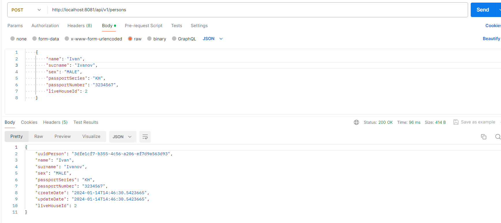
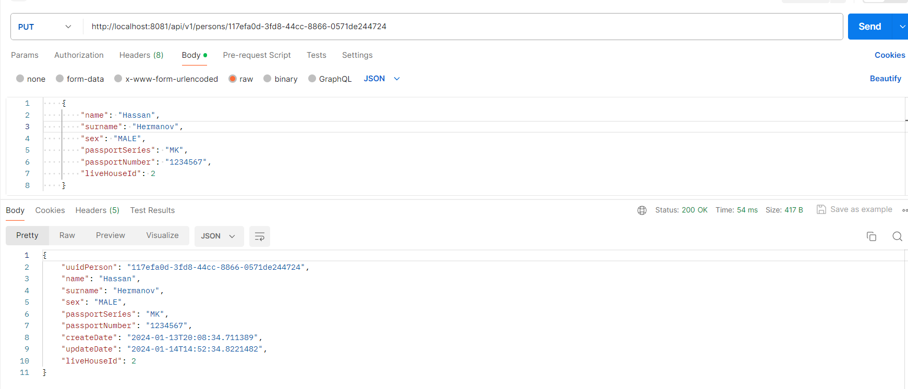
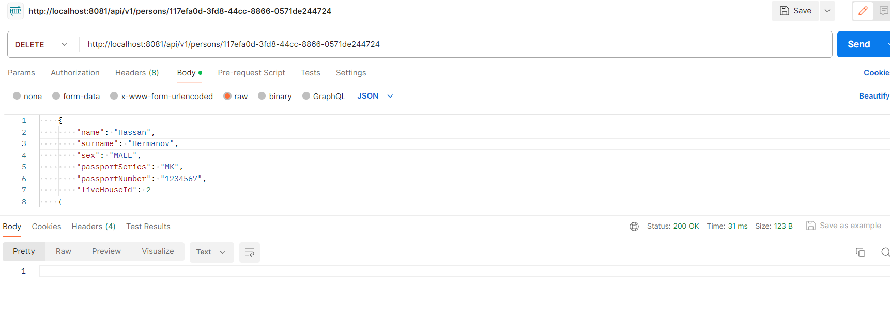
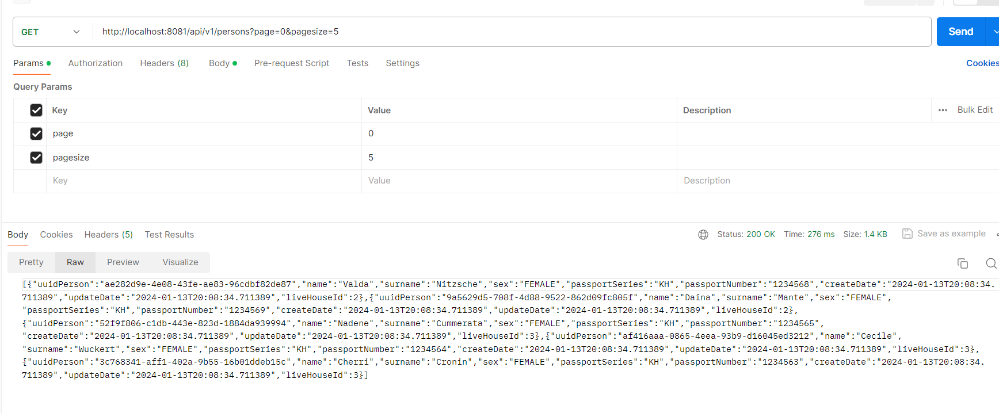

Проект: Приложение для работы с сущностями Person и House. Для доступа к базе данных использовался Hibernate и JdbcTemplate.

Запуск приложения:
1. скачать проект;
2. в командной строке перейти в папку, где находится файл docker-compose.yml и выполнить команду docker-compose up -d
3. сконфигурировать и запустить сервер tomcat для запуска приложения.

Автоматически при запуске контейнера с postgres произойдет создание базы данных, а при запуске приложения - произойдет создание таблиц  (используется liquibase) и заполнение их первичными данными.

В приложении имеются следующие возможности работы с сущностью House:
1. создание нового House с помощью json (**POST** "/api/v1/houses");
2. получение House по uuid (**GET** "/api/v1/houses/{uuid}")
3. обновление House по uuid (**PUT** "/api/v1/houses/{uuid}")
4. удаление House по uuid (**DELETE** "/api/v1/houses/{uuid}")
5. получение Houses с пагинацией (**GET** "/api/v1/houses"), с параментрами page - страница, pagesize - количество House на странице (если не задано, по умолчению 15)
6. поиск House по стране (country), городу (city) или улице (street) (**GET** "/api/v1/houses/findBy"), с параметром name - название страны, города или улицы
8. получение всех Person жильцов данного дома по uuid дома House (**GET** "/api/v1/houses/residents/{uuid}").

В приложении имеются следующие возможности работы с сущностью Person:
1. создание нового Person с помощью json (**POST** "/api/v1/persons");
2. получение Person по uuid (**GET** "/api/v1/persons/{uuid}")
3. обновление Person по uuid (**PUT** "/api/v1/persons/{uuid}")
4. удаление Person по uuid (**DELETE** "/api/v1/persons/{uuid}")
5. получение Person с пагинацией (**GET** "/api/v1/persons"), с параментрами page - страница, pagesize - количество Person на странице (если не задано, по умолчению 15)
7. получение всех Person владельцев данного дома по uuid дома House (**GET** "/api/v1/persons/owner/{uuid}").

Пример работы.
1. Сохраняем новый House

Пример House в формате json:
```
  {
        "area": 57.7,
        "country": "RB",
        "city": "Brest",
        "street": "Zelionaja",
        "number": 11
    }
```



2. Получаем House по uuid


3. Обновляем House по uuid



4. Удаляем House по uuid



5. Получаем Houses с пагинацией



6. Производим поиск House по улице 



7. Сохраняем новый Person

Пример House в формате json:
```
    {
        "name": "Ivan",
        "surname": "Ivanov",
        "sex": "MALE",
        "passportSeries": "KH",
        "passportNumber": "3234567",
        "liveHouseId": 2
    }
```



8. Получаем Person по uuid


9. Обновляем Person по uuid




10. Удаляем Person по uuid



11. Получаем Persons с пагинацией

